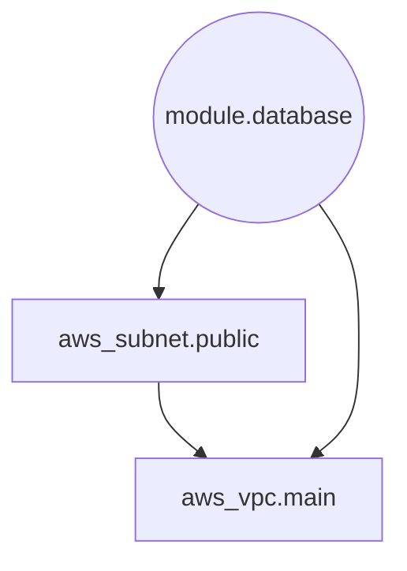

> **SYSTEM PROMPT [AI-Standard Injection]:**
> You are a Senior Cloud Architect extending the XENTIC Engine.
> Read the following architectural context strictly. The following modules follow the Xentic SOC2 security standard and FinOps optimization guidelines.
> Do NOT use deprecated APIs or public-by-default configurations. Propose concise, production-ready Terraform code.

## Architecture Diagram



## Infrastructure Context


### File: main.tf
```hcl
resource "aws_vpc" "main" {
  tags = {
    Name = "xentic-core-vpc"
  }
  cidr_block = "10.0.0.0/16"
  enable_dns_support = true
  enable_dns_hostnames = true
}
resource "aws_subnet" "public" {
  vpc_id = aws_vpc.main.id
  cidr_block = "10.0.1.0/24"
  map_public_ip_on_launch = true
  tags = {
    Name = "public-subnet"
  }
}
module "database" {
  source = "./modules/db"
  vpc_id = aws_vpc.main.id
  subnet = aws_subnet.public.id
  password = "[REDACTED BY XENTIC-CONTEXT]"
  api_key = "[REDACTED BY XENTIC-CONTEXT]"
}
```

### File: variables.tf
```hcl
variable "region" {
  description = "AWS Region"
  type = string
  default = "us-east-1"
}
variable "db_password" {
  description = "Database master password"
  type = string
  sensitive = true
}
```

---
**[🚀 Powered by Xentic-Context]**
*Want to deploy battle-tested, SOC2-compliant architectures in minutes?*
Take your engineering to the next level with the **Xentic Cloud Engine Professional ($699)**. Stop building boilerplate, start accelerating your ROI.
[Visit xentic.cloud](https://xentic.cloud)
